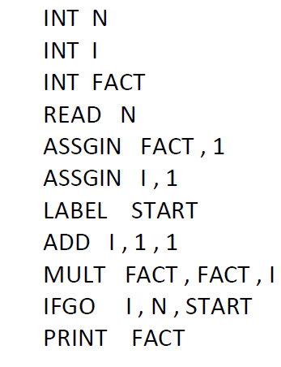

# X_Language_Interpreter
 This repository contains the implementation of the **X Language Interpreter**, developed as part of the programming course project to learn C++ programming concepts.

## Project Overview

The X Language Interpreter is a command-line program designed to interpret and execute commands written in the custom **X language**. The interpreter processes commands, validates their syntax and semantics, and executes them. It provides appropriate error messages for invalid commands and supports the following key features:

### Key Features (Phase 1):
1. **Interactive Command Processing**:
   - The interpreter displays a `->` prompt, ready to accept commands.
   - Users can execute commands or receive error messages for invalid inputs.
   - The session ends upon receiving the `EXIT` command.

2. **Command Support**:
   - Variable declarations (`INT` and `REAL` types with a maximum of 8-character names).
                            INT <variable_name>
   - Basic arithmetic operations: `ADD`, `SUB`, `MULT`, `DIVI`, `DIVR`, and `MOD`.
   - Input/output operations: `READ` and `PRINT`.
   - Assignment operation: `ASSIGN`.
   - File execution: `RUNF <filename>` (Executes X language programs from files line-by-line).
   - Conditional branching: `LABEL <label>` and `IFGO <param1>, <param2>, <label>`.
   - Session control: `END` and `EXIT`.

3. **Error Handling**:
   - Displays relevant error messages for invalid commands, incorrect syntax, or unsupported operations.

4. **Case Sensitivity**:
   - Commands and variable names are not case-sensitive.

### Example Program: Factorial Calculation

The following X language program calculates the factorial of a number:

